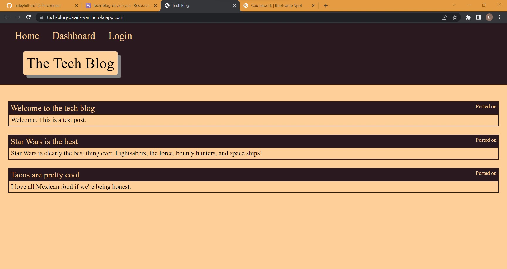

# Tech-Blog-David-Ryan
Bootcamp Homework Assignment 14.  A simple tech blog showcasing use of express, handlebars, sequelize, and deployed on heroku.

## Table of Contents
* [Description](#general-description)
* [Deplyment](#deployment)
* [Screensot](#screenshot)
* [License](#license)
* [Contributing](#contributing)
* [Tests](#tests)
* [Questions](#questions)
    
    
## Description
When you load the landing page, you see the homepage.  Buttons at the top offer links to the homepage, your dashboard, and login.  Here at the home page you can see all users posts.  The login page takes in username and password and compares it to the database, then logs you in as long as your credentials are correct.  From that page there is an option to sign up for an account.  It takes in the same info and creates an account.  Before being logged in, clicking the link to the dashboard automatically forwards you to the login page.  Once logged in, the login button in the header will be replaced with logout, which when clicked will do just that.  The dashboard, when logged in, shows you posts and offeres the ability to create new ones or update/delete your previous posts.

UNFINISHED
- Posts don't currently show the time they were last updated.
- Posts don't yet have a commenting system.

NOTE
Ran out of time.  Might update, but this is being submitted as is.

## Deployment
Deployed using Heroku at https://tech-blog-david-ryan.herokuapp.com/.

## Screenshot

## License
This repository is not licensed.

## Contributing
This is just a bootcamp assignment.  No contributions.

## Tests
No tests were created for this project.

## Questions
Any questions?  Contact me on GitHub @ https://github.com/Kadika38 or email dryan10101@gmail.com.